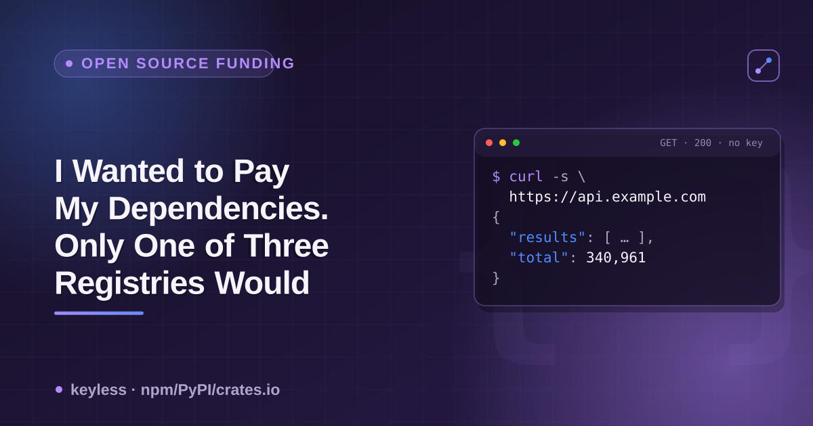

# npm, PyPI & crates.io funding metadata — a cheatsheet



If you want to know whether the maintainer of a dependency has a funding/sponsorship channel — Open Collective, GitHub Sponsors, Tidelift, a plain donate link — the three big registries answer that question in three completely different ways: one has a real schema field, one has free text under no fixed key, and one doesn't carry the concept at all in the endpoint most tooling actually uses. Checked live against real packages.

## Where each registry actually puts it

| Registry | Where it lives | Endpoint | Structured field? |
|---|---|---|---|
| npm | top-level `funding` key | `GET https://registry.npmjs.org/{name}/latest` | **Yes** — real `package.json` field, read by `npm fund` |
| PyPI | `info.project_urls{}` | `GET https://pypi.org/pypi/{name}/json` | **No** — free-text key chosen by the maintainer (`Funding`, `Donate`, …); no fixed name |
| crates.io | *(not exposed)* | `GET https://index.crates.io/{path}` (sparse index) | **No** — the sparse index has no `homepage`/`repository`/funding field for any crate; that data only lives on the separate crates.io REST API |

## npm: check the `funding` key — but the value shape varies

```bash
curl -s https://registry.npmjs.org/express/latest | python3 -c "
import json, sys
d = json.load(sys.stdin)
print(d.get('funding'))
"
# {'url': 'https://opencollective.com/express', 'type': 'opencollective'}
```

Verified live 2026-09-21 across 25 well-known packages: 9/25 (36%) had a `funding` key — `express`, `webpack`, `nodemon` (object `{url, type}`), `eslint`, `prettier`, `vite`, `chalk`, `dotenv` (bare string URL), `uuid` (array of two GitHub Sponsors URLs, one per maintainer). 16/25 did not, including `react`, `vue`, `typescript`, `jest`, `next` — several with real corporate/foundation backing that just isn't declared through this field. `npm fund` (the CLI command) reads exactly this field, recursively, across your whole dependency tree.

## PyPI: the data exists, under whatever label the maintainer picked

```bash
curl -s https://pypi.org/pypi/django/json | python3 -c "
import json, sys
print(json.load(sys.stdin)['info']['project_urls'])
"
# {'Funding': 'https://www.djangoproject.com/fundraising/', ...}
```

There is no reserved key — `project_urls` is arbitrary maintainer-typed text. Verified live 2026-09-21 on 20 popular packages, matching keys containing `fund`/`sponsor`/`donate`/`support` (case-insensitive): 8/20 (40%) matched — `django`, `pytest`, `pydantic`, `celery` used `Funding`; `flask`, `click` used `Donate`; `pillow` pointed at a Tidelift subscription URL; `matplotlib` used `Donate` → numfocus.org. The other 12 (`requests`, `numpy`, `pandas`, `scikit-learn`, `black`, `fastapi`, `sqlalchemy`, `cryptography`, `httpx`, `scrapy`, `sphinx`, `tox`) had `project_urls` but nothing this keyword match caught — that does **not** prove no funding channel exists, only that it isn't labeled with a word this heuristic checks for. There is no schema to query instead; reading every key by eye is the only complete method.

## crates.io: the sparse index doesn't carry this — or `homepage`/`repository` either

```bash
curl -s https://index.crates.io/se/rd/serde | tail -1 | python3 -m json.tool
```

Verified live 2026-09-21 on `serde`, `tokio`, `clap`, `rand`, `regex`, `anyhow`: every line has exactly `name`, `vers`, `deps`, `cksum`, `features` (+`features2` on some), `yanked`, `rust_version`, `pubtime`, `v`. No funding field — but also no `homepage` or `repository`, so there's nowhere for a funding URL to live even indirectly. That metadata exists on crates.io's separate REST API (`crates.io/api/v1/crates/{name}`), a different endpoint from the sparse index `cargo` itself resolves against.

## A separate channel that doesn't imply this one: GitHub's own `FUNDING.yml`

```bash
curl -s https://raw.githubusercontent.com/{owner}/{repo}/main/.github/FUNDING.yml
```

This is what drives the "Sponsor" button on a GitHub repo page — a completely independent mechanism from any registry's `funding`/`project_urls` field. Verified live 2026-09-21: `vuejs/core` has one (200). `facebook/react`, `lodash/lodash`, `sindresorhus/chalk`, `prettier/prettier` don't (404 on both `main` and `master`) — including `chalk`, whose own npm `funding` field points at a GitHub Sponsors URL. The two systems can, and do, disagree for the same project.


## Practical takeaway

- **npm** — query the `funding` key directly; handle all three value shapes (object, string, array) before reading `.url`.
- **PyPI** — there's no field to query, only a convention; check `project_urls` for several likely label spellings, and treat a miss as "not found under these words," not "confirmed absent."
- **crates.io** — the sparse index has nothing to check; you'd need the separate REST API, and even that has no dedicated funding concept, only whatever a maintainer put in `homepage`/`repository` or their `Cargo.toml` description.
- **GitHub's `FUNDING.yml`** is a fourth, independent channel worth checking alongside all three registries — it can exist where the registry field doesn't, and vice versa.

This is one input into what my [Package Registry Scraper](https://apify.com/ponderable_hydrometer/package-registry-scraper) actor normalizes into one row per dependency across all three registries (it doesn't pull this field yet — on the list). The story behind why I went looking for this is on dev.to: [I Wanted to Pay My Dependencies. Only One of Three Registries Would Let Me Find Out Who to Pay.](https://dev.to/ronin13/i-wanted-to-pay-my-dependencies-only-one-of-three-registries-would-let-me-find-out-who-to-pay) (best-guess slug — dev.to appends a hash suffix on publish and sometimes truncates; confirm/fix at publish time).
